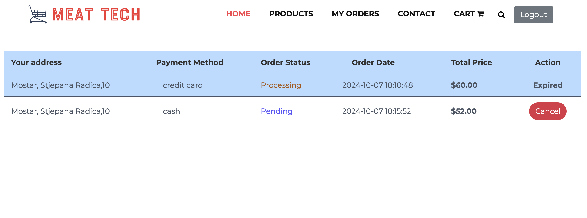

## About App
This is a complex e-commerce application built with Laravel. It allows users to browse products, manage their shopping cart, and complete purchases using Stripe for secure payment processing.

## FAST APP PREVIEW

Here are some screenshots of the app in action:

### Guest Page

### Register user

### Products Home
#### Guest

#### Search

### Cart

### Checkout

#### Credit card

#### Stripe transaction

### Orders Page

### Admin Part
#### Dashboard

#### Showing All Products

#### Orders in admin

#### Features from actions
###### Generating pdf

###### Sending email for orders

## Feature Highlights

These screenshots provide a quick preview of the core functionalities of the application, including browsing products, managing the shopping cart, and completing secure payments through Stripe. Explore the user-friendly interface designed for an effortless shopping experience.

